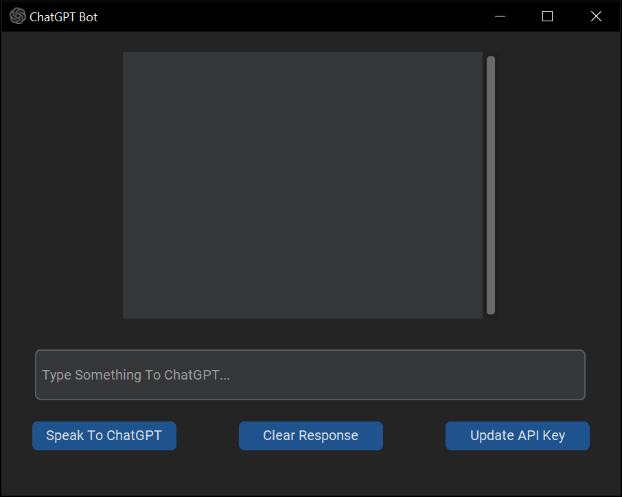

# ChatGPT-A.I.-Bot-With-Tkinter
Udemy project for learning ChatGPT

## Getting Started

First create a GUI
Second find your API key on https://beta.openai.com/account/api-keys

### Installation
Prepared environment in Visual Studio Code

### Packages

Packages to install

```
pip install tkinter
pip install customtkinter
pip install openai
pip install os
pip install pickle
```

## Initial Look

Prepare demo




### Save API Key


### Demo Results


## Authors

* **John Elder** - *Udemy Lesson* - [Udemy](https://www.udemy.com/course/create-a-chatgpt-ai-bot-with-tkinter/)
* **Crystal14w** - *Lesson* - [Certificate](http://ude.my/UC-24c975c5-38bc-4e74-8941-da9cdb030b20) 

## Acknowledgments

*Thanks to John Elder for teaching the course.
